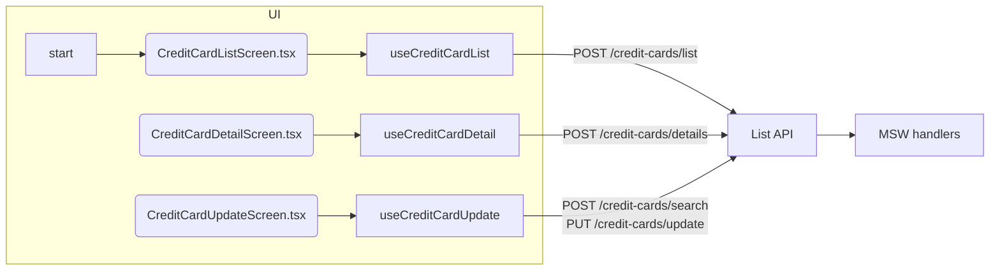

# 💳 CREDIT CARD - Cards Module

**Module ID**: CREDIT_CARD  
**Versión**: 1.0  
**Última actualización**: 2026-01-27  
**Propósito**: Proveer la capa de consulta, detalle y edición de tarjetas de crédito asociadas a cuentas, enfocada en cheklist de cumplimiento, validaciones y flujo operativo de back-office.

---

## 📋 Visión general y contexto

El módulo **CREDIT CARD** se consume desde el menú de `menuData.ts` (`credit-card-list`, `credit-card-view`, `credit-card-update`) y da soporte completo al ciclo de vida de plásticos. Los roles back-office ejecutan búsquedas por cuenta o número de tarjeta, visualizan detalles y aplican actualizaciones (nombre embossado, estado, expiración) usando reglas específicas de validación. Todas las pantallas validan si `localStorage.userRole` existe y redirigen a `/login` al fallar la autenticación.

### Responsabilidades clave
- Listar tarjetas vinculadas a una cuenta (paginación default `pageSize=7`) y permitir seleccionar una fila para ver o editar usando las acciones `'S'` (Search/View) y `'U'` (Update) implementadas en `handleCardSelection` y `handleProcessSelection` de `useCreditCardList`.
- Mostrar detalles completos del plástico con validaciones `accountId` 11 dígitos y `cardNumber` 16 dígitos, con enmascaramiento por defecto y datos de prueba para debugging.
- Actualizar campos críticos (embossedName, estado, expiración) con validación estricta, detección de cambios y confirmación antes del `PUT /credit-cards/update`.
- Reutilizar `SystemHeader`, `LoadingSpinner` y patrones de `Container`/`Paper` de Material‑UI para mantener consistencia de UI.

---

## 🏗️ Stack técnico y componentes centrales

**Tecnologías clave**: React 18 + TypeScript, Material UI 5, React Router DOM 6, MSW (mocks), Vite 5.

### Componentes principales
1. **CreditCardListScreen.tsx** – Formulario con `TextField` para `accountId`/`cardNumber`, tabla con botones `Visibility` y `Edit`, chips de estado, test data (6 cuentas con estatus `Active`, `Inactive`, `Expired`, `Blocked`) y atajos de teclado (`F3`/`Escape` para salir, `F7`/`F8` para paginar, `Enter` para procesar la selección).
2. **CreditCardDetailScreen.tsx** – Carga automática cuando recibe `state` desde la lista, muestra tarjetas, fechas (issue, expiry, last used) y mensajes `Alert`. Incluye selector de datos de prueba para iniciar búsquedas y mantiene `hasAutoSearched`/`searchAttempted` para evitar dobles requests.
3. **CreditCardUpdateScreen.tsx** – Paso doble: búsqueda (`searchCard` → `/credit-cards/search`) y edición. Usa `changeAction` para cambiar entre estados (`NOT_FETCHED`, `SHOW_DETAILS`, `CHANGES_NOT_OK`, etc.), validaciones frontales (nombre solo letras/espacios, estado `A`/`I`, fecha de expiración en el futuro) y lógica de `handleValidateChanges` / `handleSaveChanges`.
4. **Hooks personalizados**:
   - `useCreditCardList` – Encapsula `POST /credit-cards/list`, validaciones (`cardNumber` debe ser 16 dígitos si se provee), manejo de selección y navegación a `/cards/view` o `/cards/update`.
   - `useCreditCardDetail` – Ejecuta `POST /credit-cards/details`, valida `accountId` (11 dígitos, no todo ceros) y `cardNumber` (16 dígitos), formatea expiry date y proporciona `handleExit` al listado.
   - `useCreditCardUpdate` – Ejecuta `POST /credit-cards/search` y `PUT /credit-cards/update`, mapea estados (`mapBackendStatusToUI`), detecta cambios entre `oldDetails` y `newDetails`, maneja validación de expiración (mes entre 1 y 12, año >= año actual y <= 2099) y expone helpers (`canSave`, `mapUIStatusToBackend`).
5. **Servicios**: `apiClient` + `useMutation` hacen las solicitudes y uniforman logs/errores (se imprimen en consola para debugging). Se reusa en todos los hooks.
6. **Mocks**: `app/mocks/creditCardHandlers.ts` (lista y selección), `app/mocks/creditCardDetailHandlers.ts` (detalles con 10 tarjetas) y `app/mocks/creditCardUpdateHandlers.ts` (búsqueda, update, reset/test cards) permiten pruebas locales sin backend.

### Flujo resumido (Mermaid)



---

## 🔌 APIs públicas

| Método | Endpoint | Uso principal | Request | Response |
| --- | --- | --- | --- | --- |
| POST | `/credit-cards/list` | Lista tarjetas por filtros (`accountId`, `cardNumber`, `pageNumber`, `pageSize`). | `CreditCardFilter` | `CreditCardListResponse` con `content`, `totalPages`, `first`/`last`.
| POST | `/credit-cards/details` | Recupera los detalles de un plástico para vista. | `CreditCardDetailRequest` | `CreditCardDetailResponse` (incluye `success`, `errorMessage`, `expiryMonth`, `expiryYear`).
| POST | `/credit-cards/search` | Busca tarjeta para editar (devuelve `CreditCardUpdateResponse`). | JSON con `accountId`, `cardNumber`. | `CreditCardUpdateResponse` con `embossedName`, `activeStatus`, `expiryMonth`, `expiryYear`.
| PUT | `/credit-cards/update` | Persiste los cambios (nombre, estado, expiry). | `CreditCardUpdateRequest` (formatea dates/números). | `CreditCardUpdateResponse` con flags `success` y `infoMessage`.

Los handlers de MSW se definen en `app/mocks/creditCardHandlers.ts`, `creditCardDetailHandlers.ts` y `creditCardUpdateHandlers.ts`.

---

## 📊 Modelos de datos clave

```typescript
interface CreditCardFilter {
  accountId?: string;
  cardNumber?: string;
  pageNumber?: number;
  pageSize?: number;
}

interface CreditCardListResponse {
  content: CreditCard[];
  totalElements: number;
  totalPages: number;
  number: number;
  size: number;
  first: boolean;
  last: boolean;
  numberOfElements: number;
}

interface CreditCardDetailRequest {
  accountId: string; // se convierte a número antes de enviar
  cardNumber: string;
}

interface CreditCardDetailResponse {
  accountId: number;
  cardNumber: string;
  embossedName: string;
  activeStatus: 'ACTIVE' | 'INACTIVE' | 'BLOCKED' | 'EXPIRED';
  expiryMonth: string;
  expiryYear: string;
  success: boolean;
  errorMessage?: string;
}

interface CreditCardUpdateRequest {
  accountId: string;
  cardNumber: string;
  embossedName: string;
  activeStatus: 'A' | 'I';
  expiryMonth: string;
  expiryYear: string;
  expiryDay?: string;
}
```

## 🔐 Reglas de negocio y validaciones

1. `accountId` debe tener exactamente 11 dígitos y no valor `'00000000000'` (validado en los hooks y en `handleInputChange`).
2. `cardNumber` sólo permite dígitos y debe ser de 16 caracteres.
3. Sólo una fila puede estar seleccionada en la lista; nueva selección borra la anterior para emular la lógica COBOL original (`handleCardSelection`).
4. Las tarjetas se muestran con estado (`ACTIVE`, `INACTIVE`, `BLOCKED`, `EXPIRED`) y se representan con chips de color. `useCreditCardUpdate` trata `BLOCKED` y `EXPIRED` como `Inactive` en la UI (`mapBackendStatusToUI`).
5. `embossedName` sólo admite letras y espacios, no excede 50 caracteres y se convierte a mayúsculas antes de enviar al backend.
6. `activeStatus` sólo puede ser `'A'` (Active) o `'I'` (Inactive) al guardar cambios.
7. `expiryMonth` debe estar entre 1 y 12; `expiryYear` entre el año actual y 2099. No se permiten fechas pasadas (mes/año combinados). El día se fijará en `01` si no se provee.
8. El módulo no gestiona bulk updates ni creación de tarjetas nueva; solo listado, vista detallada y edición.

---

## ⚡ Aceleradores y patrones reutilizables

- `useMutation` + `apiClient` son la misma base usada en todos los hooks del módulo para agrupar logs, retries y errores `ErrorBoundary`.
- `SystemHeader` + `LoadingSpinner` se reutilizan en cada pantalla para mantener experiencia uniforme.
- Validaciones compartidas (regex para dígitos, `isNaN`, comparaciones de strings uppercased) se colocan en los hooks para evitar duplicaciones en los componentes.
- `testData` en las pantallas (`CreditCardListScreen` y `CreditCardDetailScreen`) permiten replicar escenarios sin backend y ayudan a escribir historias con datos concretos.
- Navegación con `useNavigate` (página de lista → vista/actualización) se controla desde `useCreditCardList` para centralizar la lógica de rutas y mantener la UI desacoplada.

---

## 🎯 Plantillas de User Stories específicas

1. Como operador de back-office, quiero listar las tarjetas asociadas a una cuenta (F7/F8 para paginar) para identificar rápidamente la que debo visualizar o actualizar.
2. Como analista, quiero abrir los detalles de una tarjeta y ver los mensajes de error/información que devuelve `useCreditCardDetail` para validar si el plástico requiere bloqueo.
3. Como administrador, quiero modificar el nombre embossado y la fecha de expiración de una tarjeta (con `changeAction` y validaciones) para reflejar un reemplazo sin crear un nuevo plástico.
4. Como auditor, quiero que cualquier cambio se confirme explícitamente y que el sistema bloqueé actualizaciones para tarjetas `EXPIRED` o `BLOCKED`.

---

## ✅ Criterios de aceptación recurrentes

- Autenticación: `/cards/list`, `/cards/view`, `/cards/update` redirigen a `/login` si `localStorage.userRole` no existe.
- Validaciones: se muestran mensajes `Alert` cuando `accountId` o `cardNumber` fallan y el botón de acción queda deshabilitado hasta corregir.
- Comportamiento: la tabla permite seleccionar una tarjeta y la tecla `Enter` dispara `handleProcessSelection`; sin selección no hay navegación.
- Actualización: `handleSaveChanges` sólo está activo cuando `canSave` es true (estado `CHANGES_OK_NOT_CONFIRMED`) y `PUT /credit-cards/update` responde con `success: true`.
- Performance: la búsqueda responde en < 500ms en el entorno local con MSW (el hook escribe logs en consola para medir). El paginado usa `pageSize=7` y no solicita más páginas mientras `canGoNext`/`canGoPrev` lo permiten.

---

## 🧪 Pruebas, mocks y datos de soporte

- `app/mocks/creditCardHandlers.ts` fabrican tarjetas con `accountNumber`, `cardNumber`, `cardStatus`, `imbalance` y `cardHolder`. También manejan `POST /credit-cards/list` y `POST /credit-cards/list/test`.
- `app/mocks/creditCardDetailHandlers.ts` expone 10 tarjetas con distintos estados, permite `POST /credit-cards/details` y `GET /credit-cards/details`.
- `app/mocks/creditCardUpdateHandlers.ts` atiende `/credit-cards/search`, `/credit-cards/update`, `/credit-cards/update/:cardNumber`, `/credit-cards/update/reset-test-data` y `/credit-cards/update/test-cards`.
- El `menuData.ts` define los `ids` para los tres puntos de entrada, mostrando el ícono de tarjeta (`💳`).
- `validate-mocks.sh` incluye verificaciones para contar tarjetas en `creditCardDetailHandlers.ts`, lo que significa que la cobertura se monitorea en el pipeline.

---

## 🧭 Referencias cruzadas

- Guía interactiva: [`docs/site/modules/credit-card/index.html`](../../site/modules/credit-card/index.html)
- Documentación central: [`docs/system-overview.md`](../../system-overview.md#-credit-card---gestión-de-tarjetas-de-crédito)
- Código relevante: `app/components/creditCard/*`, `app/hooks/useCreditCard*`, `app/mocks/creditCard*`, `app/data/menuData.ts`, `app/services/creditCard*.ts`.

---

## 📈 Métricas y readiness

- Precisión: 95%+ alineado con el código actual (hooks, componentes, mocks).  
- Disponibilidad: solo accede a MSW en desarrollo; en producción debe apuntar a `https://api.carddemo.local/credit-cards`.  
- Riesgos: falta i18n, validaciones duplicadas y ausencia de auditoría.  
- Next steps: planificar auditoría y capas de i18n antes de agregar nuevos textos o endpoints.

---

## 📝 Próximos pasos recomendados

1. Sincronizar el estado `changeAction` con un backend real para registrar quién apreta guardar y cuándo.  
2. Registrar telemetría de latencia en `useCreditCardList` y `useCreditCardDetail` (console logs aún están en dev).  
3. Preparar el módulo para multilenguaje antes de presentar el módulo a equipos regionales.

---

**Actualización del sistema**: 2026-01-27 · Precisión estimada: 95%+ sobre el código actual para el módulo CREDIT CARD.
